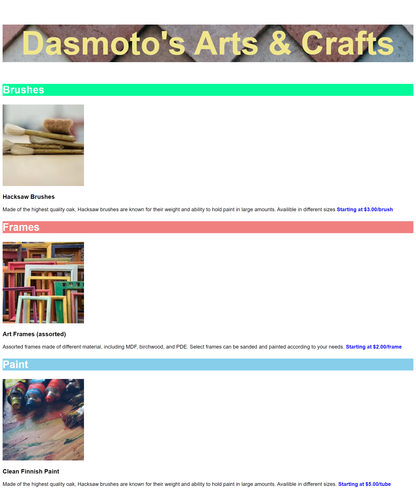

# Dasmoto's Arts & Crafts Website



## Table of Contents
1. [Project Overview](#project-overview)
2. [Live Demo](#live-demo)
3. [Features](#features)
4. [Technologies Used](#technologies-used)
5. [Setup](#setup)
6. [Usage](#usage)
7. [Contributing](#contributing)
8. [License](#license)
9. [Contact](#contact)

## Project Overview
"Dasmoto's Arts & Crafts" is a simple, yet elegantly designed webpage showcasing various art supplies. This project was developed in line with a detailed specification document, ensuring that each element meets the predefined criteria.

## Live Demo
View the live demo of the project here: [Dasmoto's Arts & Crafts Live Demo](your-deployed-application-link)

## Features
- **Product Sections:** Dedicated sections for Brushes, Frames, and Paint with detailed descriptions.
- **Responsive Design:** Ensures a great viewing experience across different devices.
- **Visual Appeal:** Vibrant colors and images that highlight the products.

## Technologies Used
- HTML5
- CSS3
- Helvetica Font

## Setup
To clone and run this application, you'll need Git and a web browser installed on your computer. From your command line:

```bash
# Clone this repository
$ git clone [your-repo-link]

# Go into the repository
$ cd [your-repo-name]

# Open the index.html in your browser

